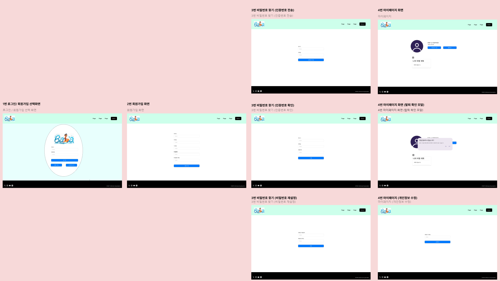
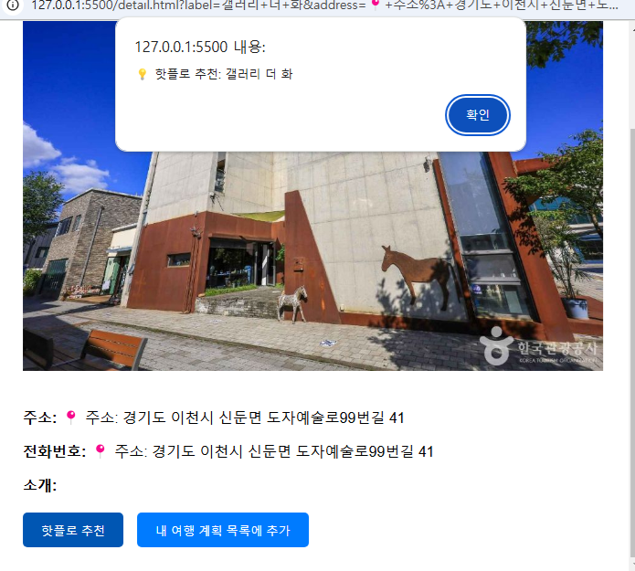

# SSAFY_TRIP_FRONT_KimEunJae_HongJeongHoon

### ✨ 목업

### ✨ 실제 화면
- 로그인 화면

- 회원가입

- 비밀번호 찾기   

- 마이페이지

- 닉네임 변경   

- 탈퇴

- 문화시설검색

- 여행계획추가

- 음식점 검색

- 자세한 정보

- 핫플추천

### ✨ 주요 기능
1. 지역별 관광지 정보 수집
2. 관광지, 숙박, 음식점 조회
3. 문화시설, 공연, 여행코스, 쇼핑 조회
4. 회원관리 (회원가입, 닉네임 변경, 마이페이지, 탈퇴)
5. 로그인 관리 (로그인, 로그아웃, 비밀번호 찾기)
6. 여행 계획 세우기 기능 제공
7. 선택했던 관광지 정보 저장 기능 제공공
